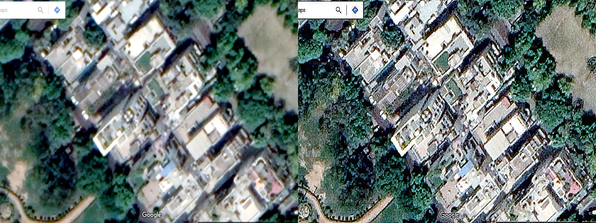
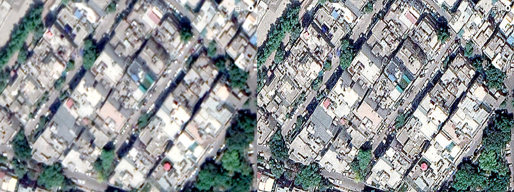
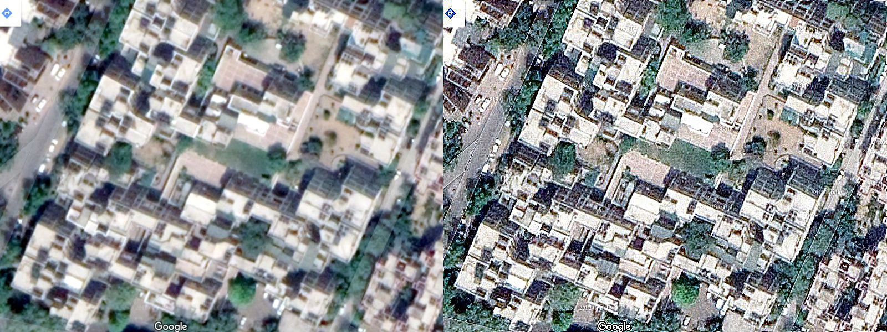
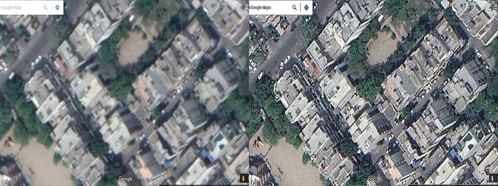
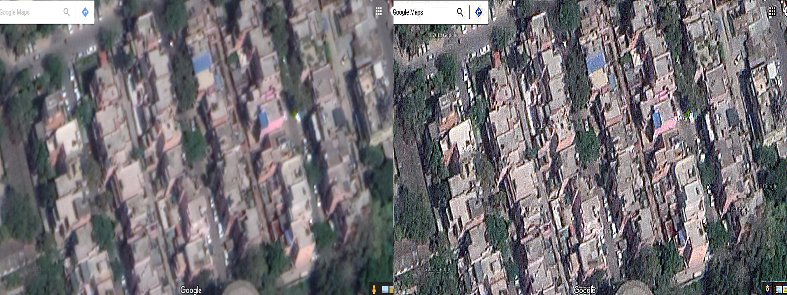

# Sharp images

__Dataset:__ Satellite Images of different areas in delhi

__Requirements:__ 
  + Python 3
  + cv2 (OpenCV)
  + numpy
 
__Concepts used:__
  * Sharpening Kernel
  * Filter2D
  * Array Stacking
  
__output (Left image is output | Right image is input):__

